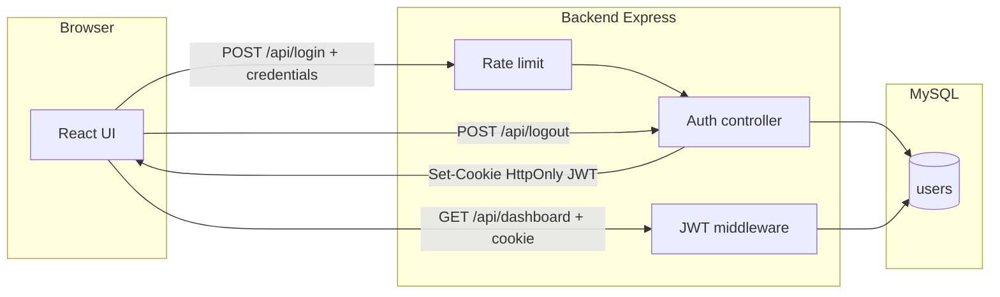

# Web Login Challenge

Aplikasi web autentikasi untuk **Web Programmer Challenge — PT. Javis Teknologi Albarokah**: login, validasi, sesi **JWT + HttpOnly cookie**, `/dashboard` terproteksi, logout, UI responsif, dark mode, loading, toast, rate limit, dan unit test validasi.

**Isi dokumen ini:** (1) **tech stack**, (2) **arsitektur** sistem, (3) **cara menjalankan** project secara lokal — termasuk database otomatis, variabel lingkungan, pengujian, dan panduan screenshot untuk pengumpulan tugas.

---

## Tech stack

| Lapisan | Teknologi |
|---------|-----------|
| **Runtime & server** | Node.js, Express 5 |
| **Frontend** | React 19 (Create React App), React Router 7, Axios |
| **Styling** | Tailwind CSS 3, PostCSS, Autoprefixer |
| **Database** | MySQL (driver `mysql2`) |
| **Autentikasi** | `jsonwebtoken`, cookie `httpOnly` + `sameSite`, `cookie-parser` |
| **Password** | `bcryptjs` (hash & compare) |
| **Keamanan tambahan** | `express-rate-limit` (5 percobaan login / menit / IP) |
| **Notifikasi UI** | `react-hot-toast` |
| **Pengujian** | Jest — `frontend` & `backend` (validasi) |

**CORS:** origin frontend lewat `FRONTEND_ORIGIN` (default `http://localhost:3000`), `credentials: true` agar cookie ikut terkirim.

---

## Arsitektur

### Alur data (diagram)



### Alur login & proteksi halaman

1. Pengguna mengisi email (atau username jika `DB_HAS_USERNAME=true`) dan password di `/`.
2. Frontend memvalidasi form; `POST /api/login` dengan Axios **`withCredentials: true`**.
3. Backend: rate limit → validasi body → query MySQL → `bcrypt.compare` → `jwt.sign` → cookie **`token`** (httpOnly, sameSite, maxAge selaras JWT).
4. Sukses: navigasi ke `/dashboard`.
5. **`/dashboard`:** `ProtectedRoute` + `AuthProvider` memanggil **`GET /api/dashboard`** sekali. Middleware membaca cookie, verifikasi JWT, mengembalikan data user (tanpa password). Gagal → redirect `/`.
6. **Logout:** `POST /api/logout` menghapus cookie → redirect `/`.

### Struktur folder (utama)

```
web-login-challenge/
├── backend/
│   ├── config/db.js
│   ├── controllers/authController.js
│   ├── middleware/authMiddleware.js, rateLimiter.js
│   ├── routes/authRoutes.js
│   ├── scripts/setup-database.js   # DB otomatis (postinstall / npm run db:setup)
│   ├── utils/validation.js, validation.test.js
│   ├── index.js
│   └── .env.example
├── frontend/
│   ├── src/
│   │   ├── api/client.js
│   │   ├── components/     # ThemeToggle, ProtectedRoute
│   │   ├── contexts/AuthContext.jsx
│   │   ├── pages/Login.jsx, Dashboard.jsx
│   │   ├── utils/validation.js, validation.test.js
│   │   ├── App.js, index.js
│   └── .env.example
├── docs/screenshots/
└── README.md
```

### Peran modul penting

| Lokasi | Peran |
|--------|--------|
| `frontend/src/api/client.js` | Base URL API + `withCredentials` |
| `Login.jsx` / `Dashboard.jsx` | Form login (validasi, loading, toast) & halaman dashboard |
| `ThemeToggle` | Dark / light + `localStorage` |
| `AuthContext` + `ProtectedRoute` | Sesi & proteksi `/dashboard` |
| `backend/middleware/authMiddleware.js` | Verifikasi JWT dari cookie |
| `backend/middleware/rateLimiter.js` | Limit `POST /api/login` |
| `backend/scripts/setup-database.js` | Buat DB + tabel + user contoh (dev) |

### Endpoint API (ringkas)

| Method | Path | Keterangan |
|--------|------|------------|
| `POST` | `/api/login` | Body: `{ "identifier", "password" }` (alias `email`). **Rate limit: 5 / menit / IP.** |
| `GET` | `/api/dashboard` | Membutuhkan cookie JWT. Response: data user. |
| `POST` | `/api/logout` | Menghapus cookie sesi. |

---

## Cara menjalankan project

### Prasyarat

- **Node.js** (LTS disarankan) dan **npm**
- **MySQL** berjalan saat `npm install` backend (atau jalankan `npm run db:setup` setelah MySQL aktif)

### Ringkasan

| Urutan | Folder | Perintah / catatan |
|--------|--------|-------------------|
| 1 | `backend/` | Salin `.env.example` → `.env`, isi **`JWT_SECRET`**, lalu `npm install` → `npm start` |
| 2 | `frontend/` | `npm install` → `npm start` |
| Akses | Browser | Frontend **http://localhost:3000**, API default **http://localhost:5000** |

Dua proses terminal harus jalan bersamaan (backend + frontend). MySQL harus bisa dihubungi backend sebelum login.

### 1. Backend & database

```bash
cd backend
```

**Environment (disarankan sebelum `npm install`):**

```bash
# Windows PowerShell
copy .env.example .env
```

Isi **`JWT_SECRET`** (wajib). Sesuaikan `DB_*` jika tidak memakai default.

**Dependency + setup database otomatis:**

```bash
npm install
```

- **`postinstall`** menjalankan `scripts/setup-database.js`: membuat database `DB_NAME` (default `login_app`), tabel `users`, dan jika kosong menambah user contoh **`admin@mail.com`** / **`987654321`** (hanya development).
- Konfigurasi dari **`backend/.env`** jika ada; jika belum, dari **`.env.example`**.
- MySQL mati saat install → `npm install` tetap sukses (ada peringatan). Setelah MySQL jalan: **`npm run db:setup`**.
- **CI / lewati setup:** `SKIP_DB_AUTO_SETUP=true`. **Tanpa user contoh:** `SKIP_DB_SEED=true`.
- Tabel dengan **`username`:** set `DB_HAS_USERNAME=true` **sebelum** tabel pertama kali dibuat (atau migrasi manual).

**Jalankan server:**

```bash
npm start
```

Console menampilkan koneksi MySQL jika berhasil.

### 2. Frontend

Terminal baru (backend tetap jalan):

```bash
cd frontend
npm install
```

Opsional: `frontend/.env.example` → `frontend/.env` jika `REACT_APP_API_URL` bukan `http://localhost:5000/api`.

```bash
npm start
```

Buka **http://localhost:3000**.

### Konfigurasi — variabel lingkungan

**Backend (`backend/.env`)**

| Variabel | Keterangan |
|----------|------------|
| `JWT_SECRET` | **Wajib** — penandatanganan JWT |
| `DB_HOST`, `DB_USER`, `DB_PASSWORD`, `DB_NAME` | MySQL (default di `config/db.js`) |
| `DB_HAS_USERNAME` | `true` jika tabel punya kolom `username` |
| `SKIP_DB_AUTO_SETUP` | `true` — lewati skrip DB saat `npm install` |
| `SKIP_DB_SEED` | `true` — tanpa user contoh |
| `FRONTEND_ORIGIN` | CORS (default `http://localhost:3000`) |
| `NODE_ENV` | `development` / `production` (pengaruh cookie `secure`) |
| `PORT` | Default `5000` |

**Frontend (`frontend/.env` — opsional)**

| Variabel | Keterangan |
|----------|------------|
| `REACT_APP_API_URL` | Base URL API |
| `REACT_APP_DB_HAS_USERNAME` | `true` untuk label login email+username |

Template: **`backend/.env.example`**, **`frontend/.env.example`**. Jangan commit file **`.env`** (berisi rahasia).

### SQL manual (opsional)

Jika tidak memakai skrip otomatis, buat DB + tabel di phpMyAdmin / client `mysql`.

**Minimal (email saja):**

```sql
CREATE DATABASE IF NOT EXISTS login_app
  CHARACTER SET utf8mb4 COLLATE utf8mb4_unicode_ci;
USE login_app;

CREATE TABLE IF NOT EXISTS users (
  id INT UNSIGNED NOT NULL AUTO_INCREMENT PRIMARY KEY,
  email VARCHAR(255) NOT NULL,
  password VARCHAR(255) NOT NULL,
  UNIQUE KEY uq_users_email (email)
) ENGINE=InnoDB DEFAULT CHARSET=utf8mb4 COLLATE=utf8mb4_unicode_ci;
```

**Dengan kolom `username`** (+ set `DB_HAS_USERNAME=true`):

```sql
CREATE DATABASE IF NOT EXISTS login_app
  CHARACTER SET utf8mb4 COLLATE utf8mb4_unicode_ci;
USE login_app;

CREATE TABLE IF NOT EXISTS users (
  id INT UNSIGNED NOT NULL AUTO_INCREMENT PRIMARY KEY,
  email VARCHAR(255) NOT NULL,
  username VARCHAR(100) DEFAULT NULL,
  password VARCHAR(255) NOT NULL,
  UNIQUE KEY uq_users_email (email),
  UNIQUE KEY uq_users_username (username)
) ENGINE=InnoDB DEFAULT CHARSET=utf8mb4 COLLATE=utf8mb4_unicode_ci;
```

`password` harus hash **bcrypt**. Generate di folder `backend`:

```bash
node -e "console.log(require('bcryptjs').hashSync('987654321', 10))"
```

Contoh `INSERT` (password `987654321`):

```sql
INSERT INTO users (email, password) VALUES (
  'admin@mail.com',
  '$2b$10$bAyYHawUigSM9nBQ425T9OJfr1suQ9oBJIhdEtkw89W9JZSB9VRFO'
);
```

### Menjalankan pengujian

**Frontend**

```bash
cd frontend
npm test
```

Sekali jalan: `npm test -- --watchAll=false`

**Backend**

```bash
cd backend
npm test
```

**Rate limit (manual):** kirim lebih dari 5× `POST /api/login` dalam satu menit → respons limit.

### Screenshot & pengumpulan tugas

Simpan **3–5** gambar di **`docs/screenshots/`** (campuran mobile & desktop). Lihat **`docs/screenshots/README.md`**.

| Saran | Isi |
|-------|-----|
| Login desktop / mobile | UI form |
| Dashboard | Setelah login |
| Dark mode | Toggle tema |
| Error login | Opsional |

**Checklist pengumpulan**

- [ ] Link repositori berisi source code  
- [ ] README.md: **cara menjalankan**, **tech stack**, **arsitektur**  
- [ ] 3–5 screenshot di `docs/screenshots/`  
- [ ] (Opsional) link demo deploy  

### Catatan production

Set `NODE_ENV=production`, `FRONTEND_ORIGIN` ke origin frontend HTTPS, ganti password user contoh, dan `JWT_SECRET` yang kuat. Proyek ini untuk challenge **PT. Javis Teknologi Albarokah**.
